# device_systems API

API REST para la administración de usuarios del sistema **device_systems**.  
Construida con **FastAPI** (Python 3.13) y **Uvicorn** como servidor ASGI.

## Descripción

La aplicación permite gestionar usuarios con las siguientes operaciones:

- Listar todos los usuarios (con soporte de filtros por `role` y `is_active`).
- Obtener un usuario específico mediante su ID.
- Registrar nuevos usuarios con validaciones (nombre mínimo 3 caracteres, email único y con formato válido, roles permitidos: `admin`, `support`, `user`).

La API incluye documentación automática interactiva (**Swagger UI** y **ReDoc**) y responde con cabeceras personalizadas (`X-App-Name`, `X-API-Version`).

## Instalación de dependencias

## Requisitos
- Python 3.13
- FastAPI 0.115.0
- Uvicorn 0.31.0

## Instalación
1. Crear entorno virtual: `python -m venv env`
2. Activar entorno: `env\Scripts\activate` (Windows) o `source env/bin/activate` (Linux/Mac)
3. Instalar dependencias: `pip install -r requirements.txt`
4. Ejecutar: `uvicorn app.main:app --reload`

## Endpoints
| Método | Ruta                     | Descripción                          |
|--------|--------------------------|--------------------------------------|
| GET    | /users                   | Listar usuarios (filtro por role/is_active) |
| GET    | /users/{user_id}         | Obtener usuario por ID               |
| POST   | /users                   | Crear nuevo usuario                  |

## Documentación interactiva
- Swagger UI: http://localhost:8000/docs
- ReDoc: http://localhost:8000/redoc

###  Ejemplos de peticiones

## Listar todos los usuarios

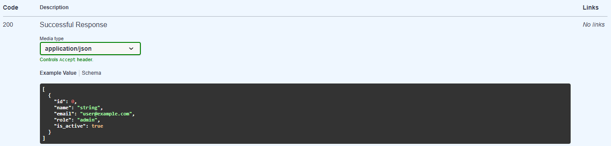

## GET con filtro por rol:

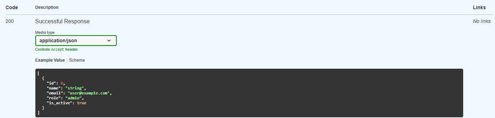

## Obtener usuario por ID

# Respuesta exitosa 

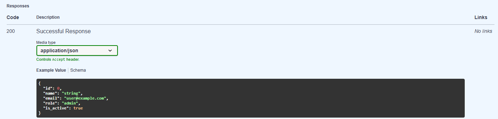

## Crear nuevo usuario

# Respuesta exitosa

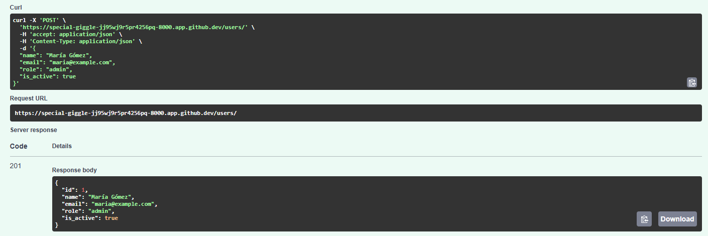

# Respuesta por email duplicado

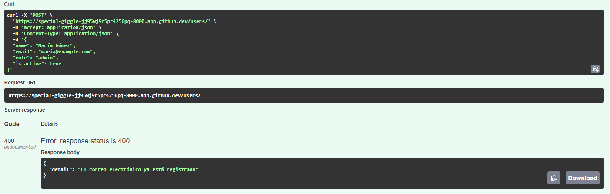

# Respuesta por validación fallida

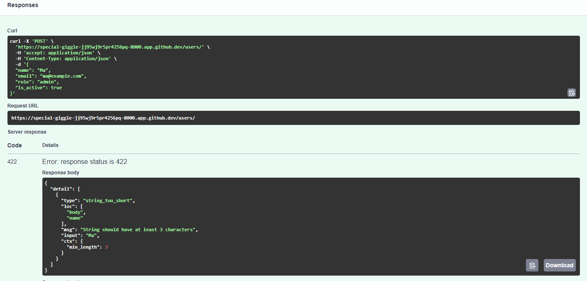

##  Capturas de Swagger UI

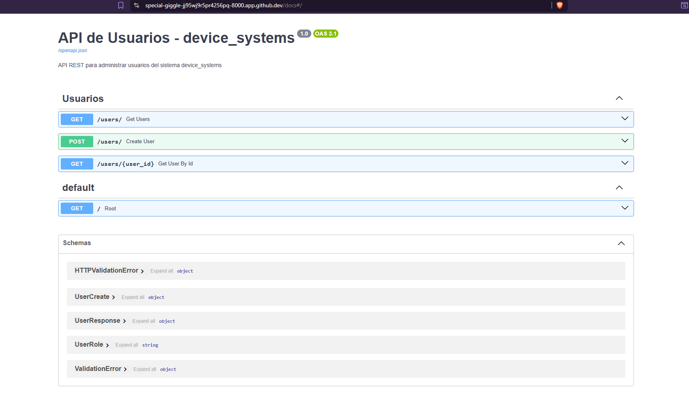

## Tecnologías utilizadas

- Python 3.13
- FastAPI 0.115.0
- Uvicorn 0.31.0 (con dependencias estándar)
- Pydantic (para validaciones y modelos)


```markdown
# device_systems API

API REST completa para la gestión de usuarios del sistema **device_systems**.  
Permite operaciones CRUD (Crear, Leer, Actualizar, Eliminar) con validaciones, filtros, manejo de errores y documentación interactiva automática.

## 📖 Descripción

La API expone un recurso `/users` sobre el cual se pueden realizar las siguientes operaciones:

- Listar todos los usuarios (con soporte de filtros por `role` y `is_active`).
- Obtener un usuario específico por su ID.
- Crear un nuevo usuario con validaciones estrictas.
- Actualizar completamente un usuario (PUT).
- Actualizar parcialmente un usuario (PATCH).
- Eliminar un usuario (DELETE).

La API utiliza **FastAPI** y **Pydantic** para validación automática, **HTTPException** para manejo de errores, **Dependency Injection** (`Depends()`) para reutilizar lógica común, y genera documentación interactiva en **Swagger UI** y **ReDoc**.

## Tecnologías utilizadas

- **Python 3.13**
- **FastAPI** – framework web asíncrono
- **Uvicorn** – servidor ASGI
- **Pydantic** – validación de datos y modelos
- **email-validator** – validación de emails

## Instalación de dependencias

### Requisitos previos
- Python 3.13 instalado
- `pip` actualizado

### Pasos

1. **Clonar o crear el proyecto** (estructura ya definida).

2. **Crear y activar un entorno virtual** (recomendado):

```bash
# En la raíz del proyecto device_systems/
python -m venv env

# Activar en Windows (PowerShell)
env\Scripts\Activate.ps1

# Activar en macOS/Linux
source env/bin/activate
```

3. **Instalar dependencias** desde `requirements.txt`:

```bash
pip install -r requirements.txt
```

El archivo `requirements.txt` debe contener:

```
fastapi==0.115.0
uvicorn[standard]==0.31.0
email-validator>=2.0.0
```

4. **Verificar instalación**:

```bash
pip show fastapi uvicorn
```

## Ejecución del servidor

Con el entorno virtual activado y estando en la carpeta raíz (`device_systems/`), ejecuta:

```bash
uvicorn app.main:app --reload
```

- `--reload` permite recarga automática al detectar cambios.
- El servidor se iniciará en `http://127.0.0.1:8000`.

Para detenerlo: `Ctrl + C`.

## Tabla de endpoints

| Método | Endpoint                     | Descripción                                          | Código de éxito |
|--------|------------------------------|------------------------------------------------------|-----------------|
| GET    | `/`                          | Mensaje de bienvenida y enlace a documentación.      | 200 OK          |
| GET    | `/users`                     | Lista todos los usuarios (filtros opcionales).       | 200 OK          |
| GET    | `/users/{user_id}`           | Obtiene un usuario por su ID.                        | 200 OK          |
| POST   | `/users`                     | Crea un nuevo usuario.                               | 201 Created     |
| PUT    | `/users/{user_id}`           | Reemplaza completamente un usuario existente.        | 200 OK          |
| PATCH  | `/users/{user_id}`           | Actualiza parcialmente un usuario (solo campos enviados). | 200 OK      |
| DELETE | `/users/{user_id}`           | Elimina un usuario.                                  | 204 No Content  |

## Ejemplos de peticiones y respuestas

### GET /users – Listar usuarios con filtros

**Petición:**
```bash
curl -X GET "http://localhost:8000/users?role=admin&is_active=true"
```

**Respuesta (200 OK):**
```json
[
  {
    "id": 1,
    "name": "Ana López",
    "email": "ana@example.com",
    "role": "admin",
    "is_active": true
  }
]
```

### GET /users/{user_id} – Obtener usuario por ID

**Petición:**
```bash
curl -X GET "http://localhost:8000/users/1"
```

**Respuesta (200 OK):**
```json
{
  "id": 1,
  "name": "Ana López",
  "email": "ana@example.com",
  "role": "admin",
  "is_active": true
}
```

**Error (404 Not Found):**
```json
{
  "detail": "Usuario con ID 999 no encontrado"
}
```

### POST /users – Crear usuario

**Petición:**
```bash
curl -X POST "http://localhost:8000/users" \
  -H "Content-Type: application/json" \
  -d '{
    "name": "Carlos Pérez",
    "email": "carlos@example.com",
    "role": "user",
    "is_active": true
  }'
```

**Respuesta (201 Created):**
```json
{
  "id": 2,
  "name": "Carlos Pérez",
  "email": "carlos@example.com",
  "role": "user",
  "is_active": true
}
```

**Error por email duplicado (400 Bad Request):**
```json
{
  "detail": "El correo electrónico ya está registrado"
}
```

**Error por datos inválidos (422 Unprocessable Entity):**
```json
{
  "detail": [
    {
      "type": "string_too_short",
      "loc": ["body", "name"],
      "msg": "String should have at least 3 characters",
      "input": "Ab"
    }
  ]
}
```

### PUT /users/{user_id} – Actualización completa

**Petición (reemplaza todo el usuario):**
```bash
curl -X PUT "http://localhost:8000/users/2" \
  -H "Content-Type: application/json" \
  -d '{
    "name": "Carlos Gómez",
    "email": "carlos.gomez@example.com",
    "role": "support",
    "is_active": false
  }'
```

**Respuesta (200 OK):**
```json
{
  "id": 2,
  "name": "Carlos Gómez",
  "email": "carlos.gomez@example.com",
  "role": "support",
  "is_active": false
}
```

### PATCH /users/{user_id} – Actualización parcial

**Petición (solo cambia el rol):**
```bash
curl -X PATCH "http://localhost:8000/users/2" \
  -H "Content-Type: application/json" \
  -d '{
    "role": "admin"
  }'
```

**Respuesta (200 OK):**
```json
{
  "id": 2,
  "name": "Carlos Gómez",
  "email": "carlos.gomez@example.com",
  "role": "admin",
  "is_active": false
}
```

**Error si no se envía ningún campo (400 Bad Request):**
```json
{
  "detail": "Debe enviar al menos un campo para actualizar"
}
```

### DELETE /users/{user_id} – Eliminar usuario

**Petición:**
```bash
curl -X DELETE "http://localhost:8000/users/2"
```

**Respuesta (204 No Content):** *sin cuerpo*

**Error si el usuario no existe (404 Not Found):**
```json
{
  "detail": "Usuario no encontrado"
}
```

## Códigos de estado usados

| Código | Significado                          | Cuándo se usa                                                                 |
|--------|--------------------------------------|-------------------------------------------------------------------------------|
| 200    | OK                                   | GET, PUT, PATCH exitosos.                                                     |
| 201    | Created                              | POST exitoso (usuario creado).                                               |
| 204    | No Content                           | DELETE exitoso (sin cuerpo de respuesta).                                    |
| 400    | Bad Request                          | Email duplicado, PATCH sin datos, validaciones de negocio.                   |
| 404    | Not Found                            | Usuario no encontrado por ID.                                                |
| 422    | Unprocessable Entity                 | Datos de entrada no cumplen validaciones de Pydantic (tipo, formato, longitud). |

## Capturas de Swagger UI

**Ejemplo de vista general de endpoints:**


## Capturas Pruebas Funcionales


**GET /users – listar**
**Con filtros: ?role=admin&is_active=true**


**GET /users/1 – obtener por ID**


**POST /users – crear**


**PUT /users/1 – actualización completa**


**PATCH /users/1 – actualización parcial**


**DELETE /users/1 – eliminar**


# Escenarios de error obligatorios:

**Buscar usuario inexistente → GET /users/999 → 404**


**Crear usuario con correo repetido → POST con email ya usado → 400**


**Crear usuario con datos inválidos (ej. name="ab") → 422**


**Actualizar usuario inexistente (PUT/PATCH con ID inválido) → 404**


**PATCH vacío (enviar {}) → 400**


**Eliminar usuario inexistente → DELETE /users/999 → 404**


## Uso de Dependency Injection con Depends()

FastAPI permite **inyectar dependencias** reutilizables en los endpoints usando la función `Depends()`. En este proyecto, las dependencias se definen en `app/dependencies/user_dependencies.py` y se usan en las rutas para evitar duplicar lógica común.

### Ejemplo de dependencia implementada:

```python
def get_user_or_404(user_id: int, db: list):
    for user in db:
        if user["id"] == user_id:
            return user
    raise HTTPException(status_code=404, detail=f"Usuario con ID {user_id} no encontrado")
```

Esta función se puede inyectar en cualquier endpoint que necesite recuperar un usuario por ID, lanzando automáticamente un error 404 si no existe.

### Uso en la ruta (aunque en el código se llamó manualmente, la idea conceptual es):

```python
@router.get("/{user_id}")
def get_user(user: dict = Depends(lambda: get_user_or_404(user_id, fake_db))):
    return user
```

Las dependencias permiten:
- **Reutilizar** validaciones (email duplicado, rol permitido).
- **Centralizar** la lógica de acceso a datos.
- **Mejorar la testabilidad** (se pueden simular dependencias en pruebas).
- **Mantener el código limpio** y enfocado en la lógica de negocio.

## Manejo de errores implementado

Se utiliza `HTTPException` de FastAPI para devolver respuestas de error con códigos HTTP apropiados. Los casos controlados son:

1. **Usuario no encontrado** (cualquier operación por ID) → `404 Not Found`.
2. **Correo electrónico duplicado** (POST o PUT con email ya existente) → `400 Bad Request`.
3. **Rol no permitido** (lo valida automáticamente Pydantic con Enum, devuelve 422).
4. **Intento de actualización sin datos** (PATCH con cuerpo vacío) → `400 Bad Request`.
5. **Datos con formato inválido** (ej. name muy corto, email mal formado) → `422 Unprocessable Entity`.

Ejemplo de respuesta de error estructurada (por defecto FastAPI):

```json
{
  "detail": "El correo electrónico ya está registrado"
}
```

Opcionalmente, se pueden personalizar para devolver más contexto (no implementado en esta versión base).

## Link del video

https://www.loom.com/share/b0a7c7fdb33d4d8eac7cad4304c5b8fe


### Fast API SQL ALCHEMY

## device_systems API

API REST completa para la gestión de usuarios del sistema **device_systems**.  
Permite operaciones CRUD con validaciones, filtros, manejo de errores y documentación interactiva automática.

# Tecnologías utilizadas

- Python 3.13
- FastAPI 0.115.0
- Uvicorn (servidor ASGI)
- Pydantic (validación de datos)
- email-validator

# Instalación de dependencias

```bash
python -m venv env
source env/bin/activate  # o env\Scripts\activate en Windows
pip install -r requirements.txt
```

# Ejecutar el servidor

```bash

uvicorn app.main:app --reload

```

## Captura de la estructura del proyecto


## Captura de la base de datos generada


## Capturas de Swagger UI


## Ejemplos de peticiones y respuestas

# 1. Crear un usuario válido.


# 2. Intentar crear un usuario con email repetido.


# 3. Listar usuarios.


# 4. Consultar usuario por ID.


# 5. Consultar usuario inexistente.


# 6. Filtrar usuarios por rol.


# 7. Filtrar usuarios activos.


# 8. Actualizar usuario completo con PUT.


# 9. Actualizar parcialmente un usuario con PATCH.


# 10. Eliminar usuario con DELETE.


# 11. Validar que el usuario eliminado ya no exista.


## Diferencia entre modelo SQLAlchemy y schema Pydantic

| **Modelo SQLAlchemy** | **Schema Pydantic** |
|-----------------------|----------------------|
| Define la estructura de la tabla en la base de datos. | Define la estructura de datos para la API (entrada/salida). |
| Hereda de `DeclarativeBase`. | Hereda de `BaseModel`. |
| Usa tipos SQL: `Column(Integer)`, `Column(String)`. | Usa tipos Python + validaciones: `str`, `int`, `EmailStr`, `Field(...)`. |
| Contiene metadatos de persistencia: `nullable`, `unique`, `default`. | Define reglas de validación de negocio: `min_length`, `pattern`, `ge`, `le`. |
| No se expone directamente al cliente (puede tener campos internos como `password_hash`). | Controla exactamente qué campos se reciben y se devuelven (seguridad, ocultación). |
| Se convierte a schema Pydantic para enviar respuestas. | Se convierte a modelo SQLAlchemy para guardar en BD (con `**model_dump()`). |

**Ejemplo práctico:**

```python
# SQLAlchemy Model
class User(Base):
    __tablename__ = "usuarios"
    id = Column(Integer, primary_key=True)
    name = Column(String(100), nullable=False)
    email = Column(String(255), unique=True, nullable=False)
    password_hash = Column(String(255))  # No se expone

# Pydantic Schema (respuesta)
class UserResponse(BaseModel):
    id: int
    name: str
    email: EmailStr
    # password_hash no está presente → seguro
```

## Reflexión final sobre la importancia de usar persistencia en una API

> **La persistencia es el corazón de cualquier API funcional en un entorno real.** Sin almacenamiento permanente, los datos se pierden cada vez que el servidor se reinicia, lo que hace imposible mantener estado entre sesiones de usuario, facturación, historiales, etc.
>
> Al integrar **SQLAlchemy** con FastAPI, logramos:
> - **Datos duraderos**: la información sobrevive a reinicios y despliegues.
> - **Consultas eficientes**: el ORM traduce operaciones Python a SQL optimizado.
> - **Integridad referencial**: podemos relacionar tablas (usuarios, pedidos, productos) y mantener consistencia con claves foráneas.
> - **Escalabilidad**: pasar de SQLite (desarrollo) a PostgreSQL/MySQL (producción) solo cambia la URL de conexión.
> - **Seguridad**: previene inyección SQL mediante parametrización automática.
>
> Sin persistencia, una API es solo un juguete de demostración. Con una base de datos robusta, se convierte en una herramienta útil para aplicaciones reales. Por eso, en este proyecto hemos evolucionado desde una lista en memoria hacia un modelo con SQLAlchemy, sentando las bases para un sistema profesional.

### Link del video

https://www.loom.com/share/c019616fd9244ac7912ff8d87e2339b8


# device_systems (versión con Alembic y relaciones)

API REST para la gestión de **usuarios**, **dispositivos** y **préstamos**.  
Incluye migraciones con **Alembic**, relaciones **One‑to‑Many** y **Many‑to‑One**, consultas con **joins** y filtros avanzados.

---

## Tecnologías utilizadas

- Python 3.13
- FastAPI
- SQLAlchemy (ORM)
- Alembic (migraciones)
- SQLite (base de datos)
- Pydantic
- Uvicorn

---

## Instalación y ejecución

### 1. Clonar y crear entorno virtual

```bash
python -m venv env
source env/bin/activate   # Linux/Mac
env\Scripts\activate      # Windows
```

### 2. Instalar dependencias

```bash
pip install -r requirements.txt
```

### 3. Configurar y aplicar migraciones

```bash
alembic upgrade head
```

### 4. Ejecutar el servidor

```bash
uvicorn app.main:app --reload
```

La API estará disponible en `http://localhost:8000`.

---

## Migraciones con Alembic

### Captura de `alembic init`


```bash
$ alembic init alembic
Creating directory /workspaces/device_systems/alembic ... done
Creating file /workspaces/device_systems/alembic/README ... done
Creating file /workspaces/device_systems/alembic/script.py.mako ... done
Creating file /workspaces/device_systems/alembic/env.py ... done
Creating file /workspaces/device_systems/alembic.ini ... done
```

---

### Captura de `alembic revision --autogenerate`

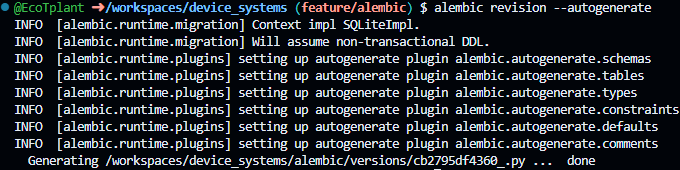

```bash
$ alembic revision --autogenerate -m "create users devices loans tables"
INFO  [alembic.runtime.migration] Context impl SQLiteImpl.
INFO  [alembic.runtime.migration] Will assume non-transactional DDL.
INFO  [alembic.runtime.plugins] setting up autogenerate plugin alembic.autogenerate.schemas
INFO  [alembic.runtime.plugins] setting up autogenerate plugin alembic.autogenerate.tables
INFO  [alembic.runtime.plugins] setting up autogenerate plugin alembic.autogenerate.types
INFO  [alembic.runtime.plugins] setting up autogenerate plugin alembic.autogenerate.constraints
INFO  [alembic.runtime.plugins] setting up autogenerate plugin alembic.autogenerate.defaults
INFO  [alembic.runtime.plugins] setting up autogenerate plugin alembic.autogenerate.comments
Generating /workspaces/device_systems/alembic/versions/cb2795df4360_.py ...  done
```

---

### Captura de `alembic upgrade head`

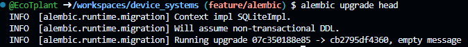

```bash
$ alembic upgrade head
INFO  [alembic.runtime.migration] Context impl SQLiteImpl.
INFO  [alembic.runtime.migration] Will assume non-transactional DDL.
INFO  [alembic.runtime.migration] Running upgrade 07c350188e85 -> cb2795df4360, empty message
```

---

### Captura de la estructura de tablas (desde DB Browser o `sqlite3`)

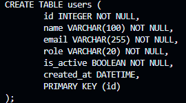

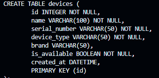

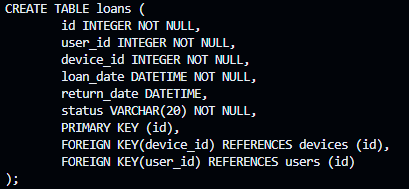


---

## Documentación interactiva (Swagger UI)

### Vista general de `/docs`

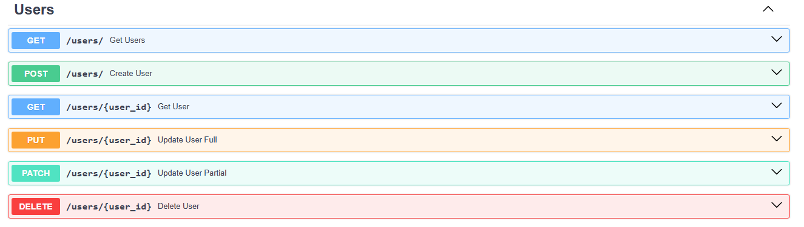

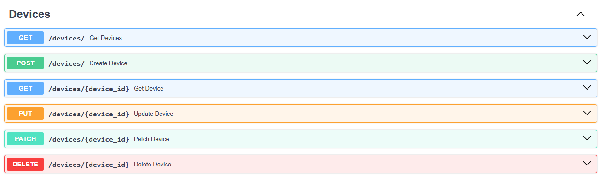

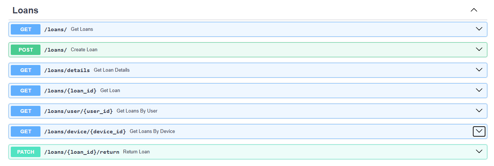

---

### Detalle de un endpoint (ej. POST /loans)

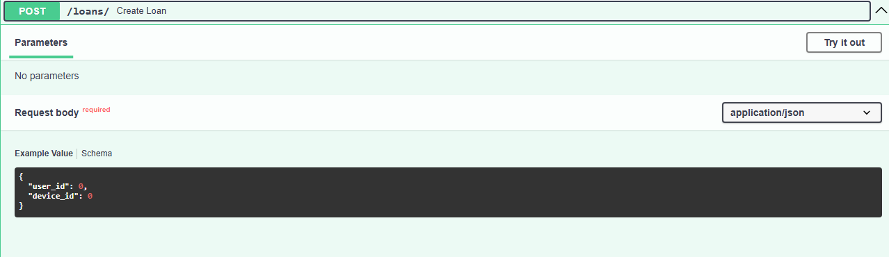

---

## Evidencia de pruebas funcionales

### 1. Crear usuario – `POST /users`


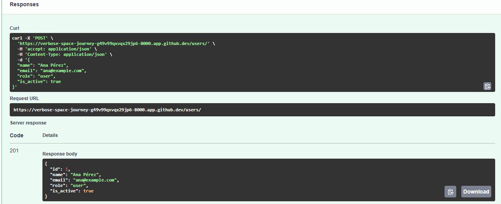


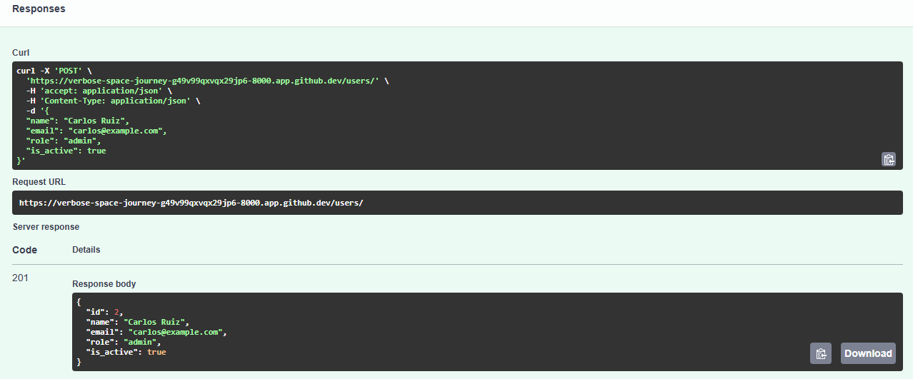

---

### 2. Crear dispositivo – `POST /devices`


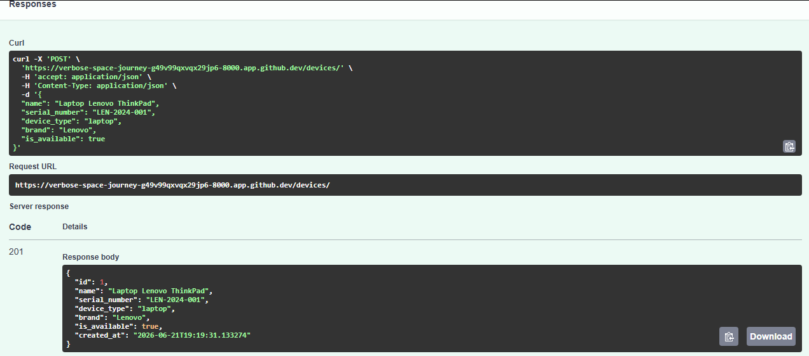

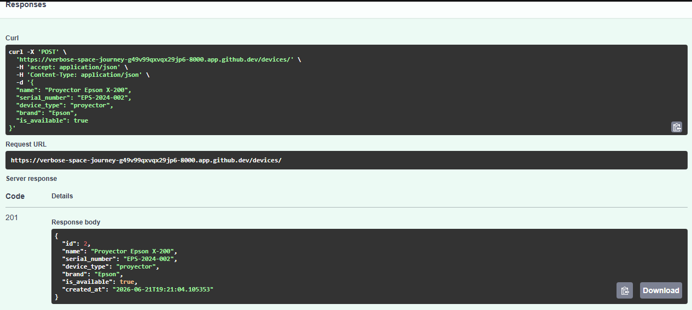

---

### 3. Crear préstamo – `POST /loans`

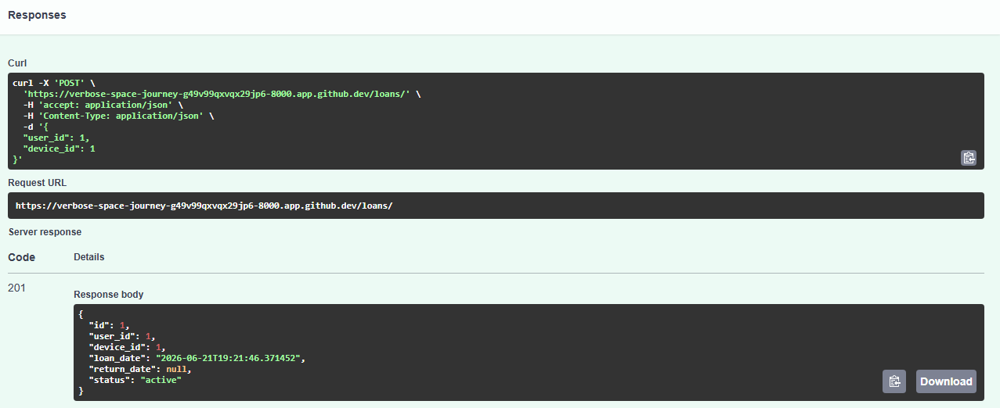

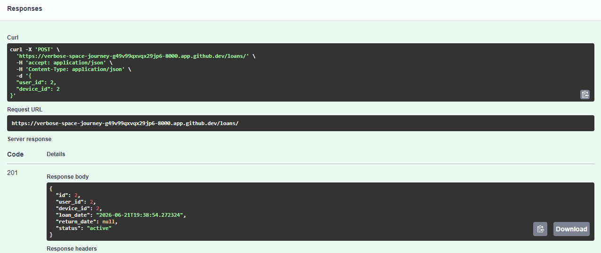

---

### 4. Consulta con joins – `GET /loans/details`

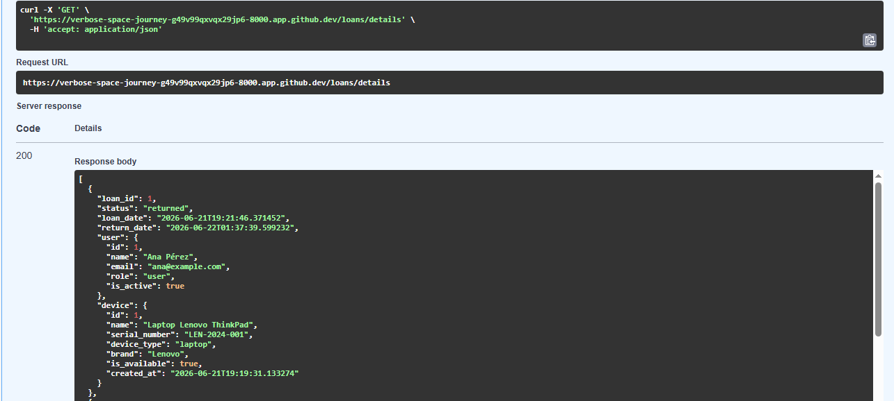

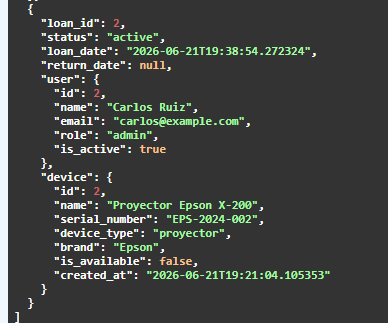

---

### 5. Filtros aplicados

#### a) Filtrar préstamos por estado – `GET /loans?status=active - returned`

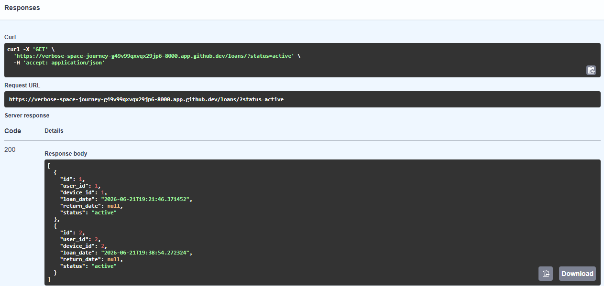

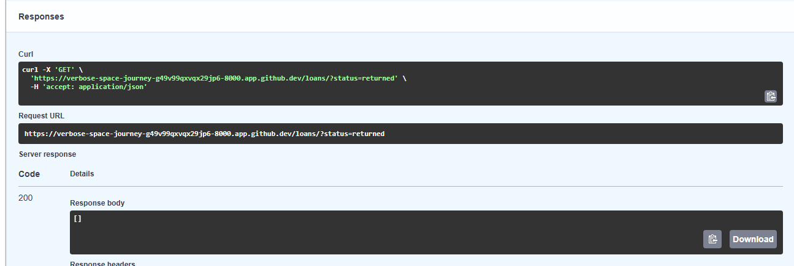

#### b) Filtrar por tipo de dispositivo – `GET /loans?device_type=laptop`

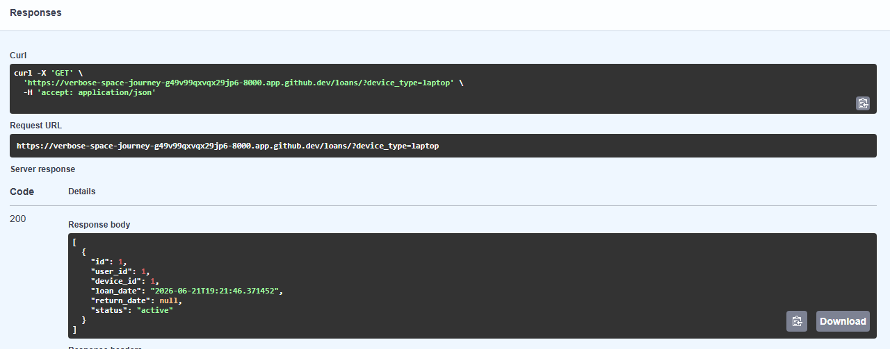


#### c) Filtrar por email de usuario – `GET /loans/user/{user_id}`

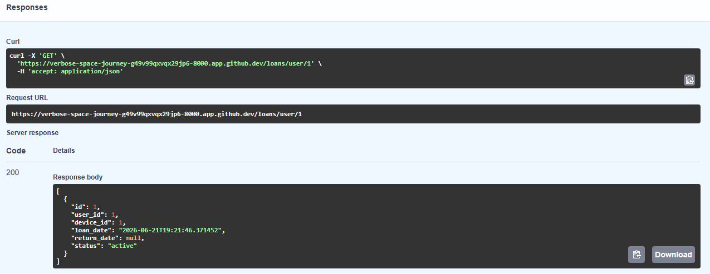

---

### 6. Devolución de dispositivo – `PATCH /loans/1/return`

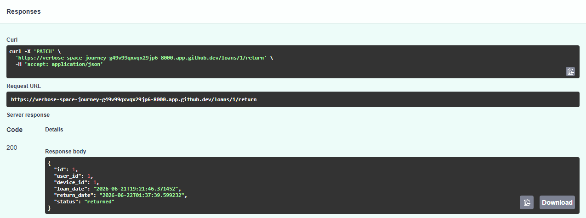

---
### 7. Verificar que el dispositivo vuelve a estar disponible (GET /devices/{device_id})

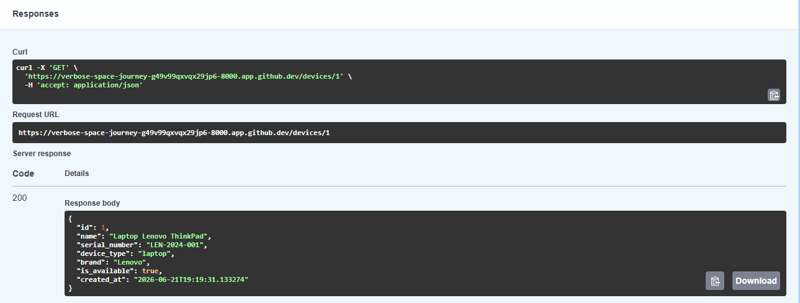

### 8. Consultar historial de préstamos del dispositivo – `GET /loans/device/1`

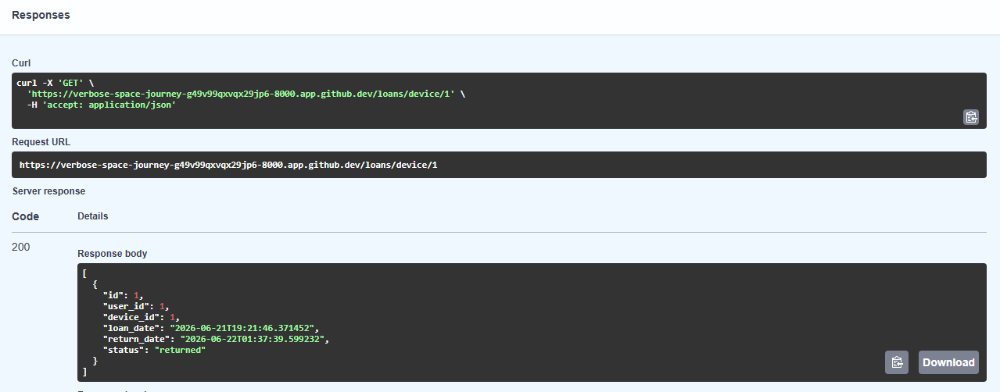

---

## Reflexión final

> **Sobre migraciones:**  
> Alembic permite **versionar** los cambios en la estructura de la base de datos. Esto es fundamental en entornos colaborativos y productivos, ya que garantiza que todos los entornos (desarrollo, pruebas, producción) tengan el mismo esquema. Sin migraciones, la base de datos se vuelve un punto frágil que puede romperse al añadir nuevas funcionalidades.

> **Sobre relaciones:**  
> Definir relaciones con `ForeignKey` y `relationship()` no solo simplifica el código, sino que **preserva la integridad referencial** a nivel de base de datos. La relación `User → Loan → Device` refleja fielmente el dominio del problema y permite recorrer los datos de forma natural, sin escribir consultas SQL complejas a mano.

> **Sobre consultas con joins:**  
> Los `joins` nos permiten **enriquecer la respuesta** de la API con información de varias tablas en una sola llamada. Gracias a SQLAlchemy, podemos construir consultas con filtros dinámicos (`where`, `like`, `or_`) que mejoran la experiencia del usuario final y reducen el número de peticiones al servidor.

> En conjunto, estas herramientas transforman una API básica en un sistema robusto, mantenible y escalable. El tiempo invertido en aprender Alembic, diseñar buenas relaciones y dominar las consultas avanzadas se amortiza con creces cuando la aplicación crece o cambia de requisitos.


### Link del video

https://www.loom.com/share/92c5650ec7b648fab5ee7b5c55330117
